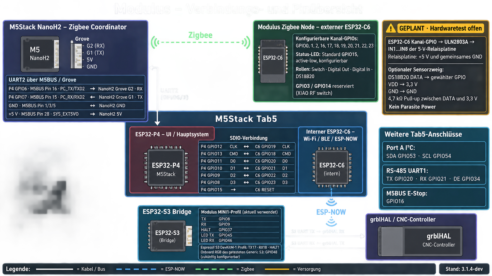

<p align="center">
  
</p>

<p align="center">
  <a href="https://www.youtube.com/watch?v=mvP2etHl_e0">
    
  </a>
</p>

<p align="center"><strong><a href="https://www.youtube.com/watch?v=mvP2etHl_e0">Watch the Modulus project video</a></strong></p>

<p align="center">
  <strong>English</strong> · <a href="README.de.md">Deutsch</a>
</p>

# Modulus Firmware

**Version:** 3.1.5-ota<br>
**Author:** D. McLean / BufferRoot  
**Platform:** M5Stack Tab5 (ESP32-P4 + ESP32-C6)  
**Stack:** Zig 0.16 + ESP-IDF 6  
**Hackster:** [Modulus pendant](https://www.hackster.io/BufferRoot/modulus-the-ultimate-universal-smart-cnc-pendant-2587ed) · [M5Stack GIC 2026](https://m5stack.com/global-innovation-contest-2026)  
**License:** [MIT](LICENSE)

**Thanks:** Special thanks to **Sae** and **Miklos** for repeatedly testing the
Tab5 ↔ S3 radio link and providing the diagnostics that led to the fixed-channel design.

**One Device, One Software. Real control for any machine — no lag, no brand lock-in, no compromise.**

## Why this OTA feature branch exists

Modulus runs across multiple processors, but the Tab5's ESP32-C6 radio and the
cabinet ESP32-S3 bridge traditionally required separate USB/bootloader access.
This branch adds guarded **C6 Update** and **S3 Update** pages to M Panel. C6
application images travel over the internal ESP-Hosted/SDIO link; S3
application images travel over ESP-NOW. Both updater pages read the root of a
FAT-formatted USB-A drive and reject images built for the wrong chip. microSD
support was useful during development, but was removed from the updater UI
because the slot is inaccessible in many installed enclosures and presenting
two maintenance sources made the workflow unnecessarily ambiguous. Other
Modulus microSD features are unchanged.

The maintenance sequence is **P4 first, then C6 and/or S3**: install the P4
firmware containing the OTA UI, boot Modulus normally, and select the matching
updater. The XIAO ESP32-S3 needs the OTA-capable full image once over USB; later
updates use only its application image. Image inspection, explicit arming,
progress feedback, and a guarded restart keep every write deliberate. After a
successful C6 activation, the P4 restarts automatically after a short delay to
resynchronize the ESP-Hosted/SDIO link.
Nothing is flashed automatically.

The complete C6 and XIAO S3 OTA paths, including an S3 update from USB-A and a
successful boot from its second OTA slot, have been verified on real hardware.

> [!IMPORTANT]
> **OTA must be enabled by a one-time wired flash first.** Flash the P4 package
> over USB so the Tab5 has the OTA menus. A new or previously installed XIAO
> ESP32-S3 must then be flashed once over USB at offset `0x0` with
> `modulus-s3-xiao-full.bin` from the latest release. This installs the OTA receiver
> and dual-slot partition table. Only after that first flash can subsequent S3
> updates use `modulus-s3-xiao-ota.bin` through **M Panel → S3 Update**.
> Do not send the first-flash/full image through the OTA menu.

For the Tab5 C6, the stock ESP-Hosted firmware already provides slave OTA. The
P4 OTA-enabled firmware still has to be installed first before **C6 Update** is
available. If the C6 no longer boots or answers over SDIO, restore its complete
flash package over the C6 USB bootloader before using OTA again.

Handheld DRO + MPG **client** on Tab5 — Zig dual-core anti-lag firmware talking to grblHAL (and other engines) over ESP-NOW or RS-485. It does not replace your motion controller.

Most M5 projects cram UI and radio onto one busy chip. Modulus uses Tab5 as designed: **P4** dual-core HMI/control, **C6** for Wi-Fi/BLE/ESP-NOW, **NanoH2** for Zigbee — so motion RF and shop-IoT RF never fight.

---

## Four-firmware architecture

The following overview shows the wired buses, radio links, power connection,
and the GPIO assignments currently used by the Tab5, NanoH2, S3 bridge, and
external Zigbee node. The ULN2803A relay connection is planned and still awaits
the hardware test.



```
                 [Operator touch UI + MPG wheel]
                              │
                              ▼
┌──────────────────── ESP32-P4 (Tab5 main MCU) ────────────────────┐
│  Core 0: LVGL 720p Material 3 UI · settings · audio (async)      │
│  Core 1: heap-free ~100 Hz MPG poll · envelope · command stream  │
└─────────┬──────────────────────┬───────────────────────┬─────────┘
          │ SDIO2                │ UART GPIO6/7          │ UART1
          ▼                      ▼                       ▼
┌───────────────────┐  ┌───────────────────┐  ┌───────────────────┐
│ ESP32-C6          │  │ NanoH2 (ESP32-H2) │  │ SIT3088 RS-485    │
│ Wi-Fi 6 / BLE /   │  │ ZBOSS Zigbee hub  │  │ wired field bus   │
│ ESP-NOW           │  │ shop automation   │  │                   │
└─────────┬─────────┘  └───────────────────┘  └───────────────────┘
          │ ESP-NOW
          ▼
┌───────────────────┐
│ ESP32-S3 bridge   │ ── UART ──► CNC controller (e.g. grblHAL)
└───────────────────┘
```

| Target | Job |
|--------|-----|
| **P4** | Core 0 = UI · Core 1 = heap-free ~100 Hz MPG / envelope / streams |
| **C6** | Wi-Fi 6, BLE, ESP-NOW only (never Zigbee-exclusive builds) |
| **NanoH2** | Zigbee coordinator @ 460800 baud UART — vacuums, lights, fans |
| **S3 bridge** | Cabinet ESP-NOW → UART to controller |

**Why Zig:** no GC. Core 1 never touches the allocator, so a heavy Core 0 frame cannot stall the handwheel. Error unions + `defer` for deterministic transport cleanup. Zig owns state/jog/ABI (`src/modulus/`); C shims own IDF/BSP/LVGL.

---

## Anti-lag design

| Shop failure | Fix |
|--------------|-----|
| UI redraw delays jog | Dual-core — Core 1 never blocks on LVGL |
| Wi-Fi reconnect freezes pendant | ESP-NOW is connectionless — drop bad frame, run next |
| Bridge backlog under RF hit | Bounded S3 queue — stale frames drop (50 ms TTL) |
| 10 clicks ≠ 10 steps | `envelope.zig` clamp + NVS divider/polarity before send |
| UI refresh starves Core 0 | Dashboard timer floor ≥ 33 ms (never 16 ms under `sw_rotate`) |

**Bench numbers** (grblHAL + ESP-NOW + S3):

| Metric | Value |
|--------|-------|
| Wheel-to-motion latency | **2 ms** |
| MPG poll (Core 1) | ~100 Hz |
| ESP-NOW RTT (P4↔S3) | **25 ms** |
| Late-frame drop TTL | 50 ms |
| UI refresh floor @ 720p | ≥ 33 ms |
| ESP-NOW PHY default | 24M OFDM |
| Cold boot → live DRO | ~16 s |
| Runtime per pack | 8–10+ h (NP-F hot-swap) |

---

## Features

| Feature | Notes |
|---------|--------|
| Live multi-axis DRO + MPG | ExtEncoder; 0.001–1.0 mm detent steps |
| Overrides / hold / cycle / macros | Native commands — no HID keyboard hacks |
| Multi-engine client | grblHAL, Grbl, FluidNC, LinuxCNC, Mach3/4, Masso |
| Multi-transport | ESP-NOW, RS-485, USB serial, WebSocket, Telnet, BLE |
| Zigbee shop IoT | NanoH2 hub — Run can start dust extraction; Hold/Alarm spins down |
| Material 3 UI | Dark/light + accents · 10 settings tabs · Quick Settings · PIN lock |
| Power | INA226 (%, V, A, W) · NP-F hot-swap · PMIC soft shutdown |

**Honest status:** pendant stack complete; **grblHAL over ESP-NOW (Tab5↔S3) field-verified**. Full motion soak + live Zigbee soak still open. Other engines/transports implemented, not all field-verified. Keep the machine E-Stop in reach.

### Transports (`cnc_conn`)

✅ field-verified · 🔧 implemented · ⏳ planned

| Transport | Path | Status |
|-----------|------|--------|
| ESP-NOW | C6 → air → S3 → UART | ✅ |
| RS-485 | UART1 TX20 / RX21 / DE34 | 🔧 |
| USB serial | Direct USB / UART | 🔧 |
| WebSocket | C6 Wi-Fi | 🔧 |
| Telnet | C6 Wi-Fi | 🔧 |
| BLE | NimBLE on C6 | 🔧 |
| I2C | Bus peer | 🔧 |
| CAN | via COMMU | ⏳ |

### Motion engines (`cnc_proto`)

| Engine | Typical transport | Status |
|--------|-------------------|--------|
| grblHAL | ESP-NOW / RS-485 | ✅ |
| Classic Grbl | RS-485 / serial | 🔧 |
| FluidNC | WebSocket | 🔧 |
| LinuxCNC | Telnet | 🔧 |
| Mach3 / Mach4 | Telnet | 🔧 |
| Masso | WebSocket / UDP | 🔧 |

### Safety

Pendant E-Stop is a **convenience layer**, not a safety-rated cutoff. It rides the active link (GPIO16 NO → feed-hold `!` then soft reset). **If the wireless link is down, pendant E-Stop will not stop the machine.** Machine mushroom E-Stop is primary. Software: `envelope.zig` soft limits, zero-while-running confirm, link-offline warnings, low-battery MPG lockout.

**Out of scope (roadmap):** SC2356 camera UI · on-screen FFT  · PCNT GPIO quadrature (replace I²C ExtEncoder).

---

## Directory layout

```
src/modulus/         Zig: state, jog math, cnc_proto, envelope, ABI
firmware/tab5/       P4 app: IDF/BSP/LVGL C shims + modulus_zig
firmware/tab5-c6/    C6 ESP-Hosted wireless slave
firmware/nanoh2/     H2 Zigbee coordinator (ZBOSS)
firmware/s3-bridge/  ESP-NOW → UART bridge
cad/                 STL + CAD (enclosure / mounts)
schematics/          Schematics + wiring diagrams
assets/              README media (hero image)
scripts/             Build / flash helpers
tools/               NVS manifest generator (used by zig build)
LICENSE              MIT
```

---

## Install and update

Download the firmware from the [latest GitHub release](https://github.com/fellpower/Modulus-Firmware/releases/latest).
The Releases tab always contains the current installation files and checksums.

### Full images and app images

- A **full image** contains everything required for a clean wired installation
  and clears old settings. Flash it at address `0x0`.
- Select `modulus-tab5-full.bin` for Tab5.
- Select `modulus-s3-generic-full.bin` or `modulus-s3-xiao-full.bin` for the
  matching S3 board.
- An S3 **OTA image** is used for subsequent updates from the Tab5 S3 update menu.

### Initial installation

Connect the target through its normal USB port and write the matching single
full BIN at address `0x0`. This installs the complete bootloader, partition table,
and application. Example for a XIAO S3:

```powershell
python -m esptool --chip esp32s3 -p COM8 erase-flash
python -m esptool --chip esp32s3 -p COM8 write-flash 0x0 modulus-s3-xiao-full.bin
```

Replace COM8 with the actual port. Use the generic full image for a generic S3.
See `FLASH-README.md` in the release for the complete Tab5 and S3 commands.

### Later XIAO S3 updates

Copy the matching `modulus-s3-*-ota.bin` from the latest release to the USB stick root. Open
**M Panel → S3 → Firmware Update**, then **Refresh USB → Check S3 image → Flash S3**.
After successful verification select **Restart S3**. Set matching S3 MAC/channel
under Settings → Wireless if required.

### S3 RGB status LED

| LED indication | Meaning |
|----------------|---------|
| Solid green | ESP-NOW connection to the Tab5 is established |
| Brief cyan/blue-green | UART data was sent to or received from the CNC controller; the indication remains active for about 140 ms |
| Orange | ESP-NOW transmission error |
| Flashing violet | Searching for the configured wireless channel |
| Flashing blue | No connection; normal connection search is in progress |
| Dim amber | The S3 is still starting up |

The S3 bridge does **not** interpret the CNC machine state. In particular,
cyan/blue-green activity while the controller is in an alarm state only means
that UART data is being transferred. It is not an S3 alarm indication. The LED
returns to solid green when the link is connected and no UART traffic is active.

---

## Build from source

**Prerequisites:** Zig **0.16+** · ESP-IDF **6.0**

```bash
git clone https://github.com/BufferRoot/Modulus-Firmware.git
cd Modulus-Firmware
zig build test        # host logic + ABI parity
zig build tab5-lib    # freestanding Zig library
```

| Target | Command |
|--------|---------|
| Tab5 P4 | `.\scripts\build_tab5.ps1` then `.\scripts\flash_tab5.ps1 -Port COM5` |
| Tab5 C6 | Build with `scripts/build_tab5_c6_modulus.ps1`, then install the app via the Tab5 C6 update menu |
| NanoH2 | `idf.py -C firmware/nanoh2 flash` (hold BUTTON; enable EXT5V) |
| S3 bridge | `.\scripts\build_s3_bridge.ps1 -Action flash -Port COM8` |
| S3 XIAO | same image: USB shell `board xiao` (or factory ` -Board xiao`) then flash |

> **Use the build scripts — plain `idf.py build` is not supported for Tab5 P4.**
>
> `scripts/build_tab5.ps1` runs `scripts/patch_tab5_idf6_deps.ps1` first, which
> patches the *managed components* for ESP-IDF 6: `esp_hosted`'s CMakeLists for
> the moved `sdmmc` headers, a retry-safe `gpio_reset_pin` before GPIO
> reconfigure, and the Modulus SDIO diagnostics/drain constants. Those files
> live under `managed_components/`, which is gitignored and regenerated by the
> component manager — so the patches are reapplied on every build and are lost
> after `idf.py fullclean` or a dependency re-solve.
>
> Running `idf.py build` directly gives an image that either fails to compile or
> boots with a broken SDIO link to the C6 (`sdmmc_send_cmd returned 0x107`).
>
> `dependencies.lock` **is tracked** for every firmware. Do not delete it to
> "get newer components": an unpinned re-solve pulls releases that assume a
> newer IDF than 6.0.1 and the build breaks
> ([#2](https://github.com/BufferRoot/Modulus-Firmware/issues/2)).

Host regression test for C6 OTA: `python scripts/test_c6_ota.py` (requires Zig).

### Pinout (Tab5)

| Signal | Pin | Note |
|--------|-----|------|
| RS-485 TX / RX / DE | GPIO 20 / 21 / 34 | onboard SIT3088 |
| ExtEncoder MPG | Grove Port A (I2C) | powered via `EXT5V_EN` |
| Hardware E-Stop | GPIO16 (M5-Bus pin 2) | NO to GND, pull-up |
| NanoH2 UART | GPIO 6 TX / 7 RX | 460800 baud |

---

## BOM (short)

Tab5 · ExtEncoder + wheel · industrial NO E-Stop · Stamp NanoH2 · ESP32-S3 cabinet bridge · NP-F pack(s) · optional COMMU Module Extend.

Mechanical files: [`cad/`](cad/) · Wiring / schematics: [`schematics/`](schematics/).
